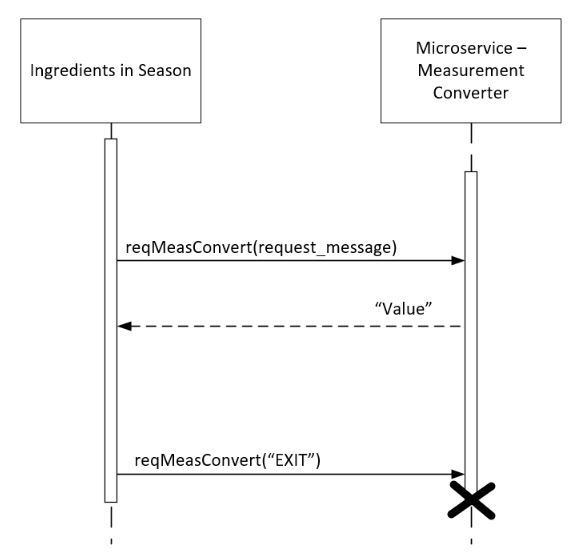

# microservice-IngredientMeasurementConverter
## Microservice to the Ingredients in Season Application

The microservice_MeasurementConverter.py program is a microservice that converts between requested measurement units and provides the converted value.
This microservice is intended to communicate with an Ingredients in Season application via a socket connection.

### How to Run:
Required data library imports are (python): import socket, import json, import time, import sys

Prior to launching, ensure that the Ingredients in Season application and the microservice are both configured to connect and communicate over the same host and port. The microservice is currently configured to connect to host='localhost' port=1234. Update these parameters as needed to ensure socket communication is set up correctly.

The Ingredients in Season application should be launched first. The Ingredients in Season application should set up a socket connection and listen for the microservice. The microservice should be launched after the Ingredients in Season application has established a socket connection. After the microservice is launched, it will connect to the socket provided by the Ingredients in Season application.

### How to Make a Request to the Microservice:
Once the Ingredients in Season application and microservice are connected to the socket, the Ingredients in Season application may send requests to the microservice to convert a given value between specified units of measurement. The Ingredients in Season application may request a specific unit conversion by sending an encoded message over the socket which contains a stringified dictionary. The dictionary must be structured such that there are three keys: "amount", "from_units", and "to_units". The "amount" value should be the value which is to be converted. The "from_units" value should be the units to be converted from, and, similarly, the "to_units" value should be the resulting units being requested. An example request call is provided below including an example dictionary definition (python):
```
example_request = {
    "amount": 1,
    "from_units": "tbsp",
    "to_units": "tsp"
}
message = json.dumps(example_request)   # serialized dict
conn.send(message.encode())
```

### How to Receive Data from the Microservice:
The microservice will receive the request and send back an encoded message which contains the converted value as a string. For the example in the above request, the encoded message sent back will be "3.0" which is the converted value from 1 tablespoon to teaspoon units. The Ingredients in Season application should receive the message over the socket connection and decode it to access the value. An example receive call by the Ingredients in Season application is provided below (python):
```
message = conn.recv(1024)
message = message.decode()
```

### UML Sequence Diagram:
A UML sequence diagram is provided to describe the communication between the Ingredients in Season application and the microservice. In the diagram, the reqMeasConvert() function represents the request call (provided earlier) and sends the encoded message containing the serialized dictionary.
The microservice sends back an encoded message with the converted value as a string.
The Ingredients in Season application may send an encoded message with the text string "EXIT" to close the microservice connection.


### Simulation provided:

A simulated Ingredients application is provided in this repository to test socket communication. The simulated Ingredients app sets up the socket connection and listens for the microservice. The microservice connects to the socket and sends the microservice name. The simulated Ingredients app can send requests to the microservice which will respond.

Requests from the Ingredients app are sent as a stringified dictionary.
The dictionary request should be in the format below:
```
request = {
    "amount": 1,
    "from_units": "tbsp",
    "to_units": "tsp"
}
```
Example requests are provided in the simulated app for testing purposes.

How to Run:
1. Start IngredientApp_Simulator.py
2. Start microservice_MeasurementConverter.py
3. Send requests from IngredientApp_Simulator.py to get converted value.
    Example requests are provided for testing purposes.
    User can simply enter "example1" and the example_message1 dictionary will be sent (stringified)
4. Type EXIT to close simulator and microservice
